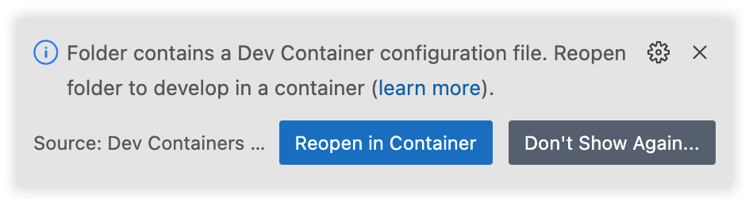
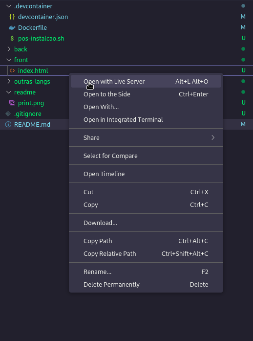

# Bem-vindo à Apresentação

## Configurando o Projeto

Antes de começarmos, vamos configurar o projeto. Certifique-se de ter a extensão "Remote Development" instalada no VSCode e o Docker em execução.

### Opção 1: Usando o Template

1. Faça um fork deste projeto ou simplesmente clone-o.
2. Abra o repositório no VSCode.
3. Ao abrir o projeto, você verá a seguinte notificação:
   
4. Clique no botão "Reopen in Container" para carregar o ambiente de desenvolvimento.

Isso é tudo! Agora você está pronto para começar a desenvolver.

### Opção 2: Usando o Botão de Simplificação

Outra opção é abrir este repositório no VSCode instantaneamente. Basta clicar no seguinte botão:

[](https://vscode.dev/redirect?url=vscode://ms-vscode-remote.remote-containers/cloneInVolume?url=https://github.com/eduumach/palestra-rest-api)

Isso irá clonar o repositório e abri-lo em um Devcontainer imediatamente.

**Dica:** Para vincular este repositório ao seu próprio repositório, adicione um controle remoto Git diferente usando o comando `git remote add`.

Espero que isso torne a configuração mais clara e fácil de seguir. Boa sorte com o desenvolvimento! 🚀

Claro, aqui estão as instruções aprimoradas para rodar o back e o front do seu projeto:

---

## Rodando o Back-End

Executar o projeto back-end é simples. Siga estas etapas:

1. Navegue até a pasta "back" usando o seguinte comando no terminal:
    ```
    cd back
    ```

2. Agora, execute o comando a seguir para iniciar o servidor Flask:
    ```
    python3 -m flask run
    ```

Seu ambiente de back-end estará agora em execução.

## Rodando o Front-End

Para executar o front-end, siga estas etapas:

1. Clique com o botão direito no arquivo "index.html" (localizado na pasta "front").

2. No menu de contexto que aparece, você verá uma opção chamada "Open with Live Server", conforme mostrado na imagem abaixo:
    

Clicar nesta opção abrirá o front-end em um servidor ao vivo.

Agora, você pode acessar seu aplicativo front-end e testá-lo. Espero que isso torne a execução do projeto mais clara e fácil. Boa programação! 🚀